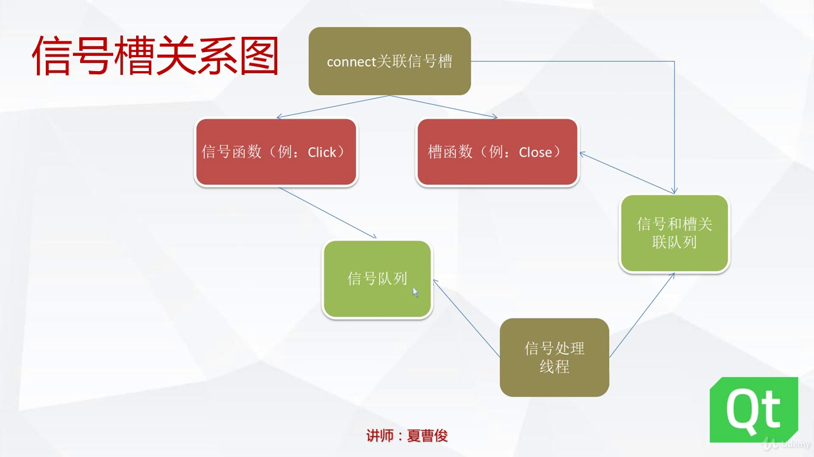

# 1. Qt信号槽的概念

## 1.1 信号槽是什么
1. 信号槽是程序内部不同对象之间进行通信的方式,是一种消息机制;
1. 信号槽是观察者模式的一种实现，或者说是一种升华；
2. 一个信号就是一个能够被观察的事件，或者至少是事件已经发生的一种通知；
3. 一个槽就是一个观察者，通常就是在被观察的对象发生改变的时候——也可以说是信号发出的时候——被调用的函数；
4. 你可以将信号和槽连接起来，形成一种观察者-被观察者的关系；
5. 当事件或者状态发生改变的时候，信号就会被发出；同时，信号发出者有义务调用所有注册的对这个事件（信号）感兴趣的函数（槽）。

## 1.2 Qt中信号槽的实现

1. 信号槽的组成
- 信号函数: 只发送消息
- 槽函数
- 连接函数: 通过QObeject的定义来进行绑定,由moc进行定义

2. 信号和槽的消息传递过程
- 绑定信号函数和槽函数
- 调用信号函数: 信号函数将信号写入信号处理线程的消息队列
- 主线程调用信号队列: 获得信号并调用信号对应的槽函数
> 特别的,槽函数只能被信号所调用而不能直接调用



## 3. 信号槽的处理主循环

```
QApplication a(argc,argv);

return a.exec();
```
由QApplicaiton类中的exec()函数监视消息队列

## 4. 信号槽实例

添加信号槽的方法
   - 设计器添加(拖动和添加,再选择设计器的信号槽编辑模式)
   - 使用内部的信号槽函数(如实现关闭窗口)
   - 点击按钮手动添加槽函数自动绑定点击事件


## 5. 手动添加信号槽
通过设计器添加方便直接,比较常用,也可以手动添加信号槽.

1. Q_OBJECT\
   Q_OBJECT是一个宏, 没有任何意义,但可以给moc程序提供一个标识符,生成对应代码.
2. 手动创建信号: 函数前添加标识符`signals`;
3. 手动创建槽: 标识符`public slots`

步骤:\
    1. 在project的头文件类里面添加信号函数.\
    ```
    signals:
        void sigFunc();//只需声明,不需要定义
    ```\
    2. 同样在类里面添加槽函数.
    ```
    public slots:
        sigFunc();
    ```
    然后在源代码里对其定义.\
    3. 绑定信号函数和槽函数.
    - 使用设计器进行绑定.
    - 手动绑定\
> 在project的源文件中\
> ```connect(this,SIGNAL(signalFun()),this,SLOT(slotFunc()));```